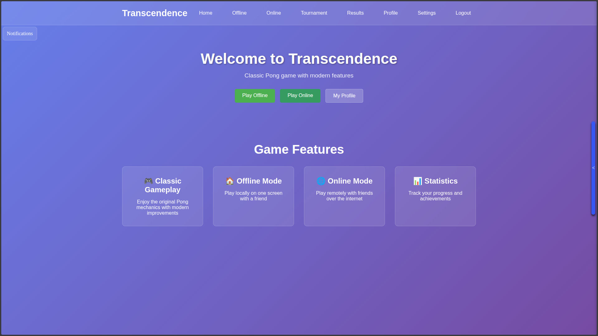
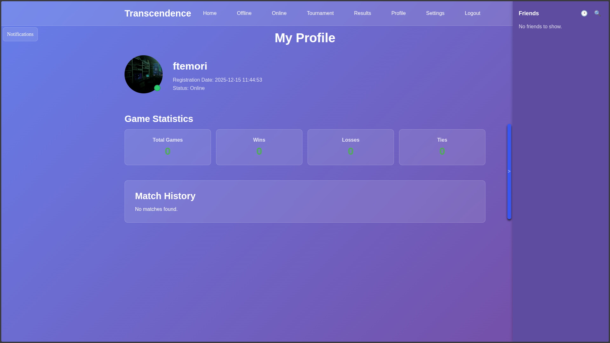
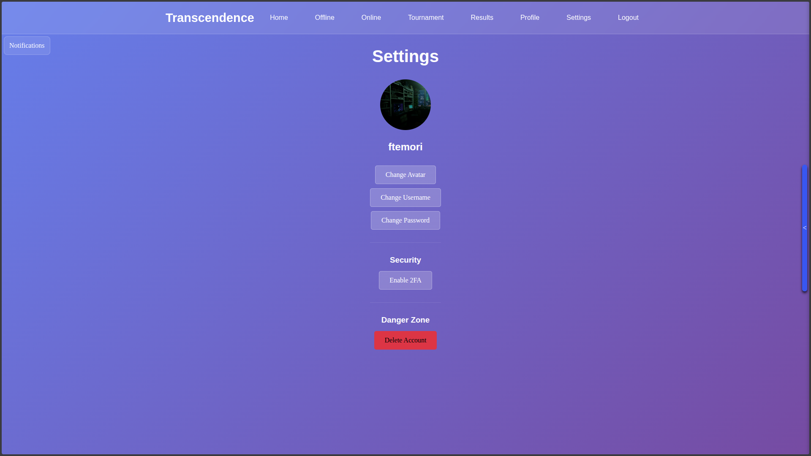
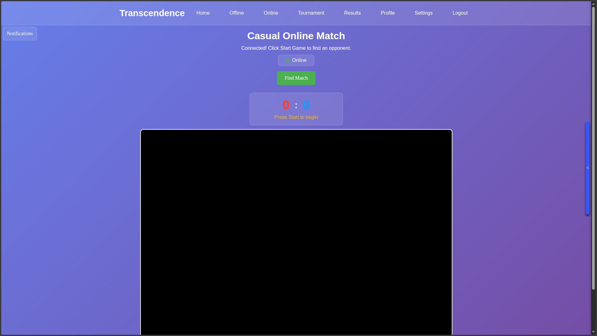
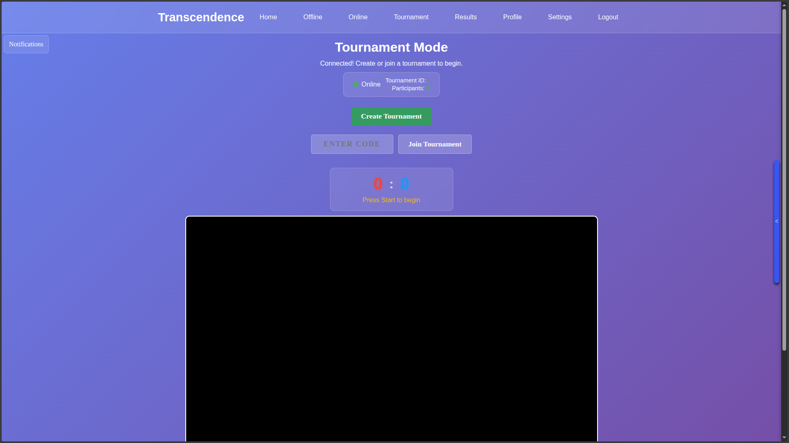
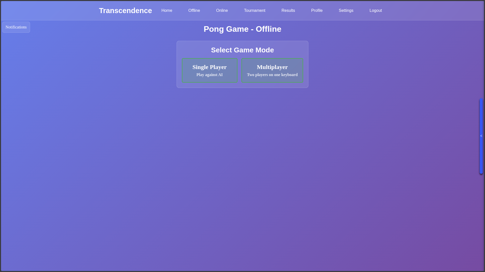
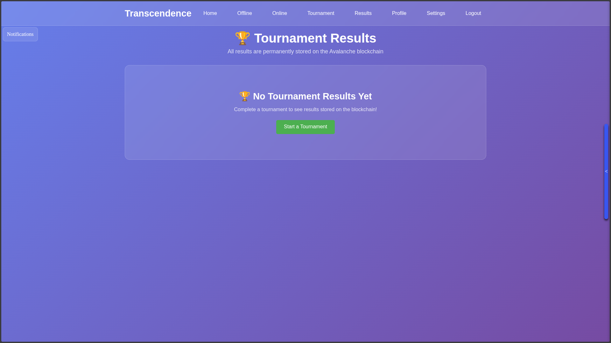

# Transcendence

## 🌟 Overview

**Transcendence** is a captivating full-stack web application inspired by the classic Pong game, transformed into a modern, multiplayer online experience. Developed as the culminating project for the 42 School curriculum, this platform allows users to authenticate via the 42 OAuth API, engage in real-time Pong matches, chat with friends, manage profiles, compete on leaderboards, and participate in tournaments. 

The application emphasizes seamless real-time interactions, user security, and a responsive design, making it an ideal showcase of web development skills. Whether you're reminiscing about retro games or diving into competitive play, Transcendence elevates the Pong experience to new heights!

## 🚀 Features

- **Secure Authentication**: Easy sign-up and login using 42's OAuth system, with optional two-factor authentication (2FA) for enhanced security.
- **Real-Time Multiplayer Pong**: Challenge friends or random opponents in live Pong games, powered by WebSockets for smooth, lag-free gameplay.
- **Integrated Chat System**: Create public channels, send private messages, or chat directly during games—complete with emojis and notifications.
- **User Profiles & Social Features**: Customize your avatar, view match history, achievements, and stats. Add friends, block users, and manage relationships.
- **Leaderboards & Rankings**: Track global and friend-based rankings based on wins, losses, and skill levels.
- **Tournament Mode**: Organize or join structured Pong tournaments with brackets and prizes.
- **Achievements & Customization**: Unlock badges for milestones and personalize your gaming experience.
- **Responsive & Mobile-Friendly**: Enjoy the app on desktops, tablets, or mobiles with a clean, intuitive interface.

## 🛠️ Technologies Stack

- **Backend**: NestJS (Node.js framework), TypeScript, JWT for authentication.
- **Database**: PostgreSQL with Prisma ORM for efficient data management.
- **Frontend**: React.js, TypeScript, Tailwind CSS for styling, and Socket.io for real-time features.
- **Real-Time Communication**: WebSockets via Socket.io for game updates and chat.
- **Deployment & Containerization**: Docker and docker-compose for easy setup and scalability.
- **Other Tools**: OAuth 2.0, RESTful APIs, Git for version control.

This stack ensures a robust, scalable, and maintainable application, highlighting best practices in full-stack development.

## 📋 Installation Guide

### Prerequisites
- Docker and docker-compose (version 1.29+)
- Node.js (v18+) and npm (if building manually)
- 42 API credentials (Client ID and Secret) – obtain from the 42 Intranet.

### Steps
1. **Clone the Repository**:
git clone https://github.com/ftemori/Transcendence.git
cd Transcendence

2. **Set Up Environment Variables**:
- Copy the example env file: `cp .env.example .env`
- Edit `.env` with your 42 API details, database credentials, and other configs (e.g., `DATABASE_URL`, `JWT_SECRET`).

3. **Build and Run with Docker (Recommended)**:
docker-compose up --build

- This will spin up the backend, frontend, and database containers.
- The app will be available at `https://localhost:8080` (or your configured port).

4. **Manual Build (Optional)**:
- Backend: `cd backend && npm install && npm run start:dev`
- Frontend: `cd frontend && npm install && npm run dev`

5. **Database Migration**:
- Run `npx prisma migrate dev` in the backend directory to set up the schema.

## 🎮 Usage

1. **Sign In**: Visit the homepage and log in with your 42 account.
2. **Profile Setup**: Upload an avatar, set a username, and enable 2FA if desired.
3. **Start Chatting**: Join existing channels or create new ones to connect with the community.
4. **Play Pong**: Queue for a match, invite friends, or spectate ongoing games.
5. **Tournaments**: Create or join events, follow brackets, and climb the ranks.
6. **Explore More**: Check leaderboards, view profiles, and unlock achievements through gameplay.

Pro Tip: Use the in-game chat to strategize during matches!

## 📸 Screenshots

These screenshots are showcasing key aspects of the application:

  
*Login Page: Secure entry point with 42 OAuth integration.*

  
*Home Dashboard: Overview of ongoing games, chats, and notifications.*

  
*User Profile: Detailed stats, achievements, and customization options.*

  
*Chat Interface: Real-time messaging with channels and direct DMs.*

  
*Pong Game: Intense multiplayer action with live score updates.*

  
*Leaderboard: Track top players and your ranking.*

  
*Settings Page: Manage account, privacy, and game preferences.*
